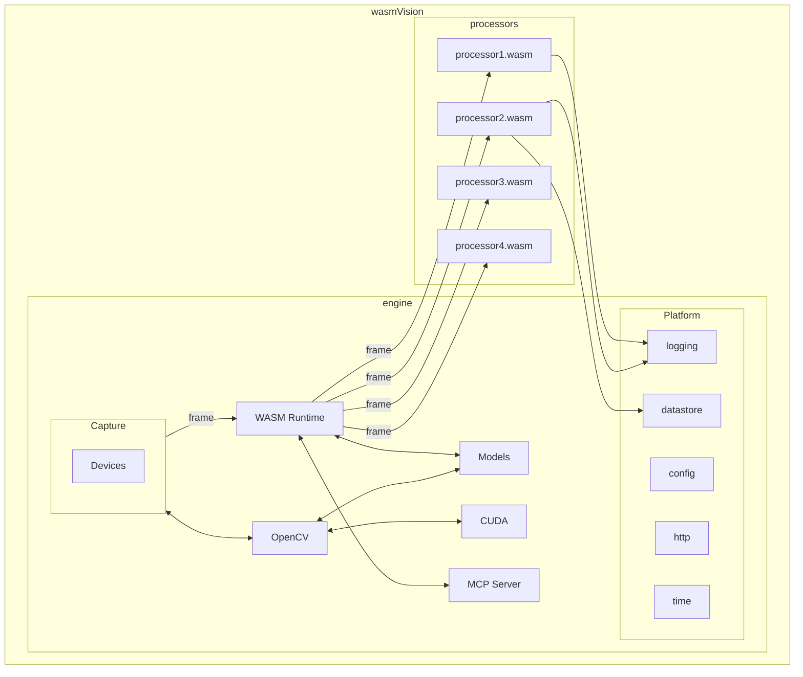

---
title: "Architecture"
linkTitle: "Architecture"
type: "docs"
weight: 35
description: >
  About the wasmVision architecture.
---

## Overview

This diagram shows the major parts of the wasmVision system architecture and how they fit together.

## Engine

The wasmVision engine. Includes platform capabilities such as MJPEG streaming and saving to files.

## Capture

This is how wasmVision can capture or import images or video to be processed from a connected webcam, from files, or from streams. For more information see [Capture](/docs/concepts/capture).

## Devices

Specific hardware or software devices that capture images or video. Currently supported devices are a connected camera, a file input, or a stream input using GStreamer.

## Runtime

The wasmVision runtime consists of the WebAssembly runtime engine (currently Wazero) and the wasmVision host platform API functions such as logging, configuration, and making http calls to external servers.

## Processors

The image processing modules that are used by wasmVision. These are modules written using Go, Rust, or C, and compiled into WebAssembly. They use the [wasmCV interface](https://github.com/wasmvision/wasmcv) and the [wasmVision platform interface](https://github.com/wasmvision/wasmvision-sdk). For more information see [Processors](/docs/concepts/processors/).

## OpenCV

The computer vision processing capabilities implemented using [OpenCV](https://github.com/opencv/opencv) with the [GoCV language wrappers](https://github.com/hybridgroup/gocv). The [wasmCV programming API](https://wasmcv.org/) is used for this integration.

## Models

Machine learning models used for computer vision that can be used directly by processors. There are "well-known" models that can be automatically downloaded by wasmVision when they are needed by a specific Processor. See the [Models list](/docs/reference/models) for more information.

## Platform

The wasmVision platform capabilities provide essential services for processing modules such as logging and access to configuration information. See [Platform](/docs/concepts/platform) for more information.

## MCP Server

wasmVision includes experimental support for the [Model Context Protocol (MCP)](https://modelcontextprotocol.info/) by providing a [(MCP) Server](https://modelcontextprotocol.info/specification/draft/server/). See [MCP](/docs/concepts/mcp) for more information.

## CUDA

wasmVision includes experimental support for GPU acceleration using [CUDA](https://en.wikipedia.org/wiki/CUDA).

See [using wasmVision with CUDA](/docs/concepts/cuda) for more information.
