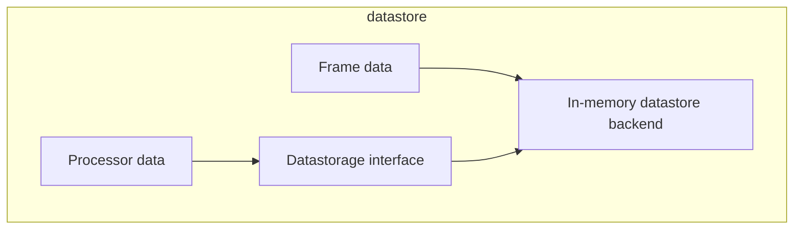

---
title: "Datastore"
linkTitle: "Datastore"
type: "docs"
weight: 55
description: >
  About the wasmVision Datastore.
---

wasmVision provides access to a key-value store for saving and retrieving data associated either with specific image frames, or else with specific processors.

## Datastore Architecture

Frame data is specific to an individual frame. The lifespan of this data is a single pass thru each processor. As a result, the only storage for frame data is in-memory.

Processor data is specific to an individual processor. The lifespan of this data is multiple frame processing cycles. Data storage for Processor data can be any backend that supports the `Datastorage` interface.

## Datastore API

See [Platform API](/docs/reference/platform#a-idwasmvision_platform_datastoreaimport-interface-wasmvisionplatformdatastore) for information.
